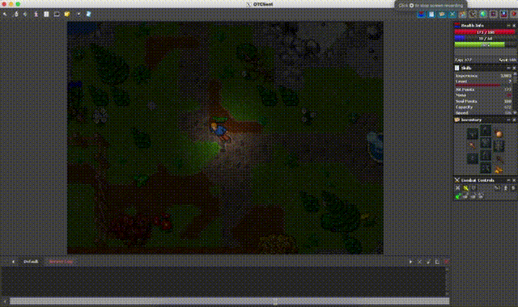

# Question 5 - Replicate Spell

## Setup
- TFS1.4.2
- `edubart/otclient-master` with 10.98 `.dat` and `.spr`
- Place the `blizzard.lua` into `<PATH_TO_TFS_DIR>/data/scripts/spells/blizzard.lua`

## Explanation
1. This spell is modified from the `eternal_winter` spell to have a sequence of cast animation
2. I created a table of spell area matrix for the animated sequence
3. I use `addEvent` to schedule the spell cast to achieve the outcome as shown in the gif
4. I am not able to find the same ice tornado asset as the given video, so the tornado position is not exactly the same, I tried my best to achieve a closest result