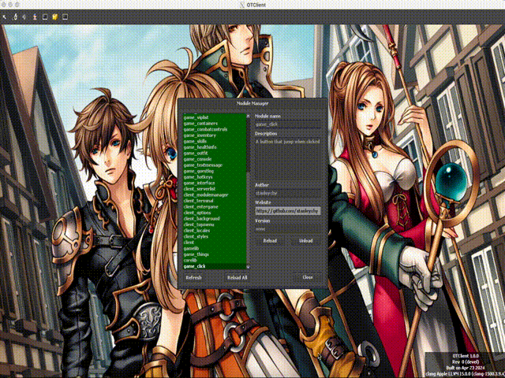

# Question 7 - Replicate UI

## Setup
- TFS1.4.2
- `edubart/otclient-master` with 10.98 `.dat` and `.spr`
- Place the `game_click/` folder into `<PATH_TO_OTC_DIR>/mods/` folder and load it to the client

## Explanation
1. The button position update is handled by `periodicalEvent`
2. The button position is calculated with a safety margin base on window's position to prevent it go out of bound
3. In the update function we check `clickWindow:isDragging()` so to pause the update while dragging window to prevent issues